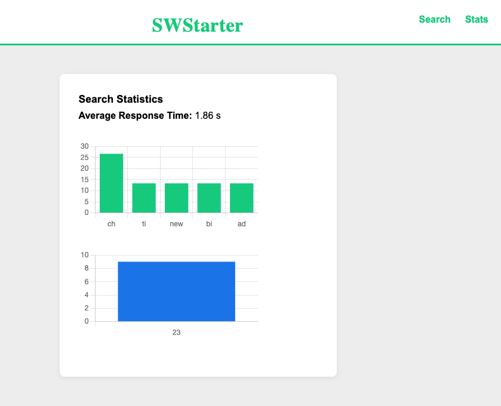

# SWStarter - Star Wars Search App

A fullstack Star Wars search application with a modern, responsive UI and a high-performance backend proxy.

## Project Structure

## Estrutura Detalhada do Projeto

```
lawnstarter/
├── backend/
│   ├── app/
│   │   ├── Console/
│   │   │   └── Commands/
│   │   │       └── ComputeSearchStatistics.php
│   │   ├── Http/
│   │   │   └── Controllers/
│   │   │       └── StarWarsController.php
│   │   └── Models/
│   ├── bootstrap/
│   ├── config/
│   ├── database/
│   ├── public/
│   ├── resources/
│   ├── routes/
│   │   └── api.php
│   ├── storage/
│   ├── tests/
│   │   ├── Feature/
│   │   │   └── StarWarsControllerTest.php
│   │   ├── Unit/
│   │   │   ├── ComputeSearchStatisticsTest.php
│   │   │   └── ExampleTest.php
│   │   └── TestCase.php
│   ├── Dockerfile
│   ├── composer.json
│   ├── composer.lock
│   ├── phpunit.xml
│   └── ...
├── frontend/
│   ├── src/
│   │   ├── pages/
│   │   │   ├── SearchPage.tsx
│   │   │   ├── SearchPage.test.tsx
│   │   │   ├── MovieDetailsPage.tsx
│   │   │   ├── PersonDetailsPage.tsx
│   │   │   └── StatsPage.tsx
│   │   ├── types/
│   │   │   └── swapi.ts
│   │   ├── utils/
│   │   │   └── getIdFromUrl.ts
│   │   ├── App.tsx
│   │   ├── App.css
│   │   └── index.tsx
│   ├── package.json
│   ├── package-lock.json
│   └── ...
├── docker-compose.yml
└── README.md
```

- **Frontend** (`frontend/`)
  - Built with React + TypeScript
  - Responsive layout: mobile (single card) and desktop (side-by-side cards)
  - Instant search: results update as you type (2+ characters)
  - Modern, clean UI styled for both mobile and desktop
  - Talks only to the backend API (never directly to SWAPI)

- **Backend** (`backend/`)
  - Built with Laravel (PHP)
  - Acts as a proxy to the [Star Wars API (SWAPI)](https://swapi.dev/)
  - **Caching:** All SWAPI responses are cached for 5 minutes for fast repeated queries
  - **Filtering:** Search endpoints filter by name (people) or title (movies) using the `q` parameter (case-insensitive, partial match)
  - Fetches and filters the entire SWAPI dataset, not just the first page
  - **Statistics system:**
    - Every search is logged to a `search_statistics` table (query, type, response time, timestamp)
    - An Artisan command computes statistics (top queries, average response time, most popular hour) every 5 minutes and caches them
    - Statistics are served instantly from cache via a dedicated endpoint
  - Stateless for search, only uses the database for statistics

- **Database**
  - Used only for logging and computing search statistics
  - No persistent user data or business data is stored

- **Docker**
  - Orchestrates frontend, backend, and database containers
  - Easy to run and develop locally

## Endpoints

- `GET /api/star-wars/characters/search?q=...` — Search people by name (filtered, cached, logs stats)
- `GET /api/star-wars/movies/search?q=...` — Search movies by title (filtered, cached, logs stats)
- `GET /api/star-wars/characters/{id}` — Get person details (cached)
- `GET /api/star-wars/movies/{id}` — Get movie details (cached)
- `GET /api/star-wars/statistics` — Get latest computed search statistics (top queries, average response time, most popular hour)

## How Statistics Work


Each query is logged in the database with the query, type, response time, and timestamp. Every 5 minutes, a scheduled job calculates statistics and caches them. The statistics endpoint returns the latest data instantly.



## How to Run (with Docker)

1. **Build and start all services:**
   ```bash
   docker compose up --build -d
   ```
2. **Access the app:**
   - Frontend: [http://localhost:3000](http://localhost:3000)
   - Backend API: [http://localhost:8000/api/star-wars/characters/search?q=luke](http://localhost:8000/api/star-wars/characters/search?q=luke)

## Testing
- The backend includes feature tests for all endpoints (search, details, statistics)
- To run tests:
  ```bash
  cd backend
  php artisan test
  ```

## Q&A Folder

This project includes a `q&a` folder containing answers and explanations in a different format, intended for appreciation and review purposes. You can refer to this folder to understand design decisions, implementation details, and reasoning behind key features.

---

Made with ❤️ for the LawnStarter challenge. 